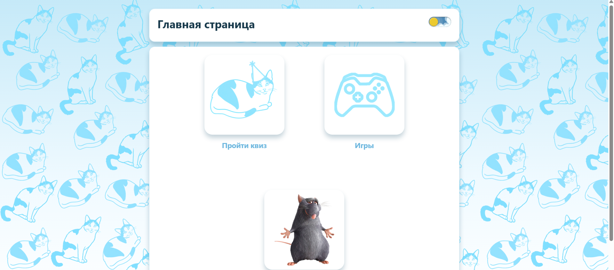
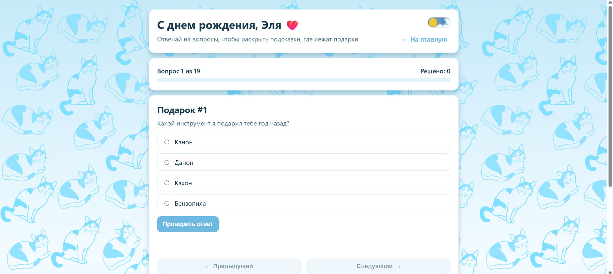
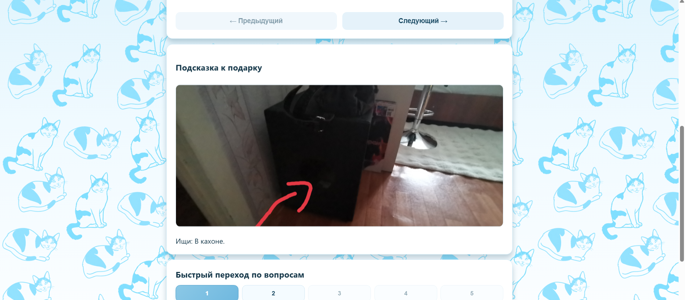
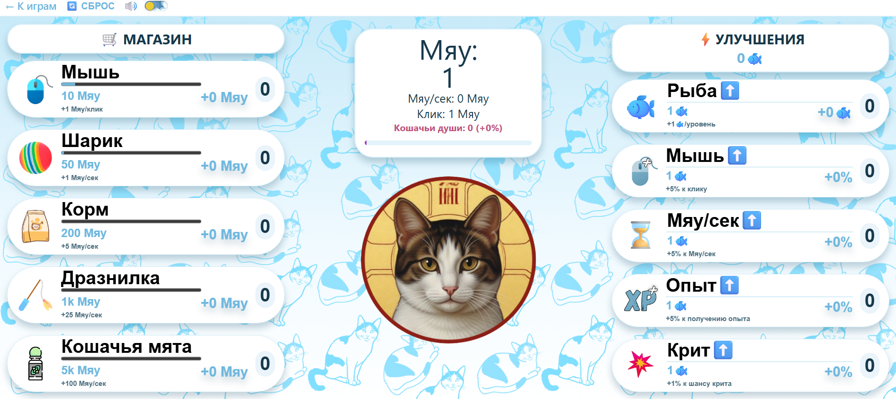
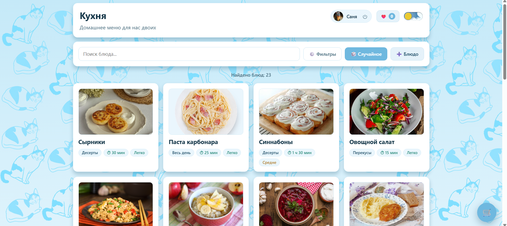
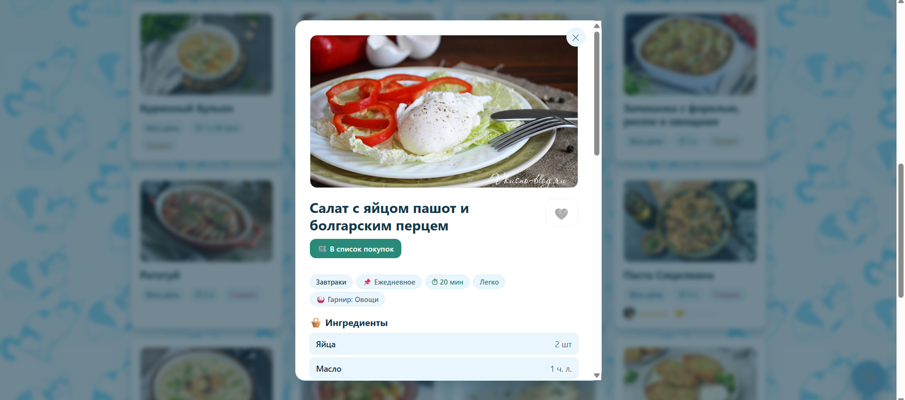

# 🎁 Сайт-подарок (Квест, Кликер, Рецепты)

Интерактивный веб-сайт, созданный в качестве подарка. Включает в себя несколько мини-игр и полезных функций.

## 🚀 Функционал
- **Квест:** Пользователь отвечает на вопросы, при правильном ответе появляется подсказка, где спрятан подарок.
- **Игра-кликер:** Счетчик очков, сохранение прогресса.
- **Генератор рецептов:** Случайный выбор блюда из списка. Формирование перечня ингредиентов для выбранного блюда.

## 🛠️ Технологии
- HTML5
- CSS3
- JavaScript (Vanilla JS, работа с DOM)

## 📦 Как запустить
1. Скачайте репозиторий.
2. Откройте файл `index.html` в браузере.

## 📸 Скриншоты

<table>
  <tr>
    <td colspan="2" align="center">
       
      <b>Главная страница сайта</b>
    </td>
  </tr>

  <tr>
    <td align="center" width="50%">
       
      Страница квеста (вопрос)
    </td>
    <td align="center" width="50%">
       
      Страница квеста (ответ)
    </td>
  </tr>

  <tr>
    <td colspan="2" align="center">
       
      <b>Страница игры</b>
    </td>
  </tr>

  <tr>
    <td align="center" width="50%">
       
      Страница с рецептами
    </td>
    <td align="center" width="50%">
       
      Страница с одним рецептом
    </td>
  </tr>
</table>

